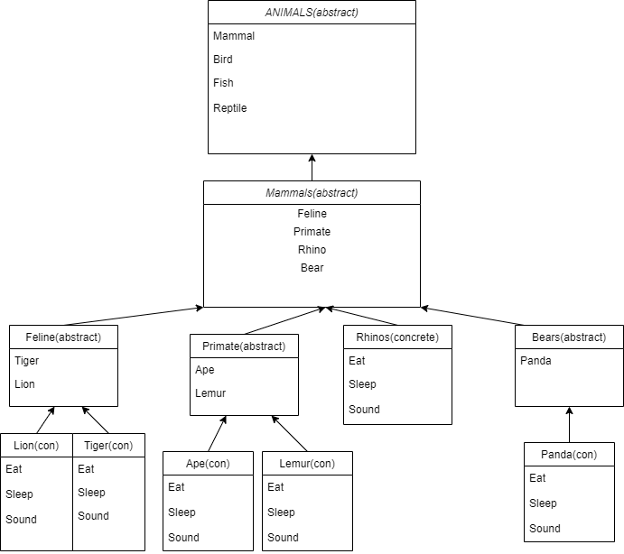

# ZOO Console Application

## ZOO

Lab06: I built a zoo

*Author: Lami Beach*

----

## Description
An console application for keeping track of my animals and their behaviors in my zoo.

---

### Getting Started
Clone this repository to your local machine.

```
$ git clone [repo clone url here]
```


---

### Visuals
***[Add screenshots of your application in action]***

#### Application Start





#### Using the Application
The first part of the assignment asks to list the each animal and their behavior.


---

### Change Log


------------------------------
