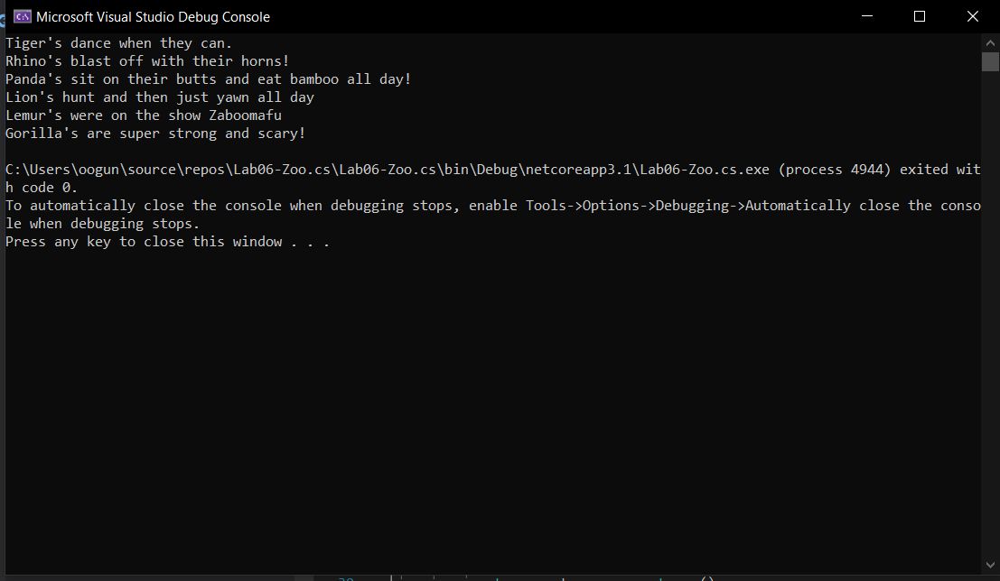
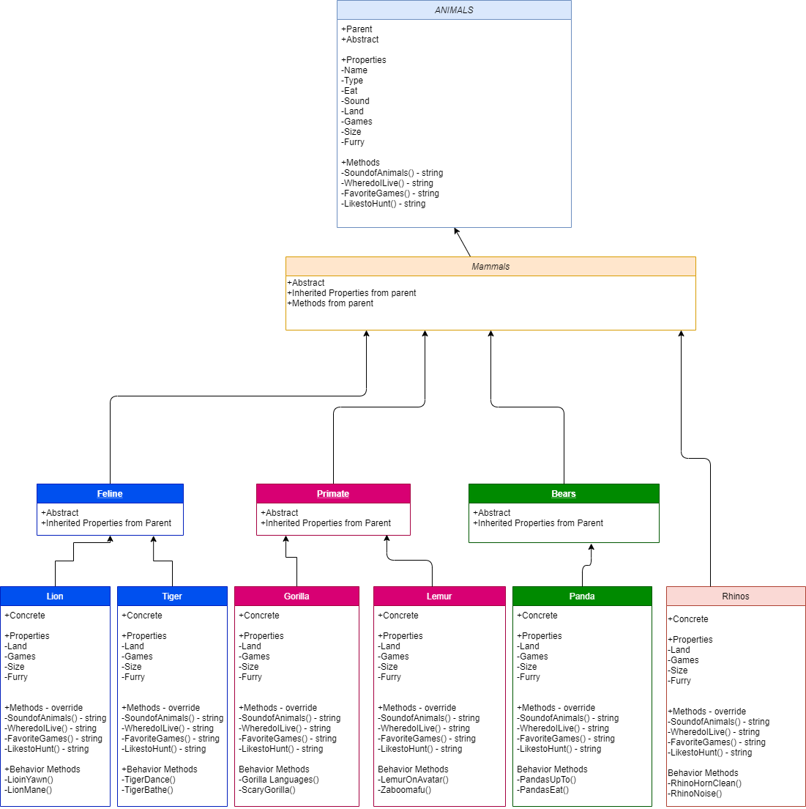

# ZOO Console Application

## ZOO

Lab06: I built a zoo

*Author: Lami Beach*

----

## Description
An console application for keeping track of my animals and their behaviors in my zoo.

Classes: Classes are a way for organizing and traversing my project.

1. Created an Animal class that serves as my base. It is abstract because the information is different for each animal.
2. Created a Mamal class that derives from the base Animal class. It is also abstract because of different mammals.
3. Created a Feline/Bear/Rhino/Primate class that derive from the Mammal class. They are also abstract.
4. Created specific animal classes i. e. (Lion, Rhino, Panda Bear) that are concrete and derive from the specific Mammal classes.
5. Attached properties, abstract and virtual, in order to manipulate the derive class data.
6. Gave each animal properties inherited from the Animal class.
7. Gave each animal public, virtual, and abstract methods. Virtual and Abstract methods derive from Animal class methods.
8. Called the inheritance method in the program file to execute the code. 




---

#UML FLOW CHART


#OOP Principals

O(n), my algorithms don't have any nested loops and scale based on one method.

For my OOP principals I gave "inheritance" to my Mammals class from my Animals class. These classes derived from Animals class
flow all the way down to concrete animal classes. My concrete animal classes derive base class properties and three base class methods.

For my OOP abstraction I made my Animals => Mammals => Feline or Primate or Bears or Rhino => Tiger or Lion => Rhino => Panda => Gorilla => Lemur.


### Getting Started
Clone this repository to your local machine.

```
$ git clone [https://github.com/Omac092627/Lab06-I_Built_A_Zoo]

```


---

### Change Log
1. V1: No unit testing
2. V1.1: Unit testing and individual behaviors


------------------------------
